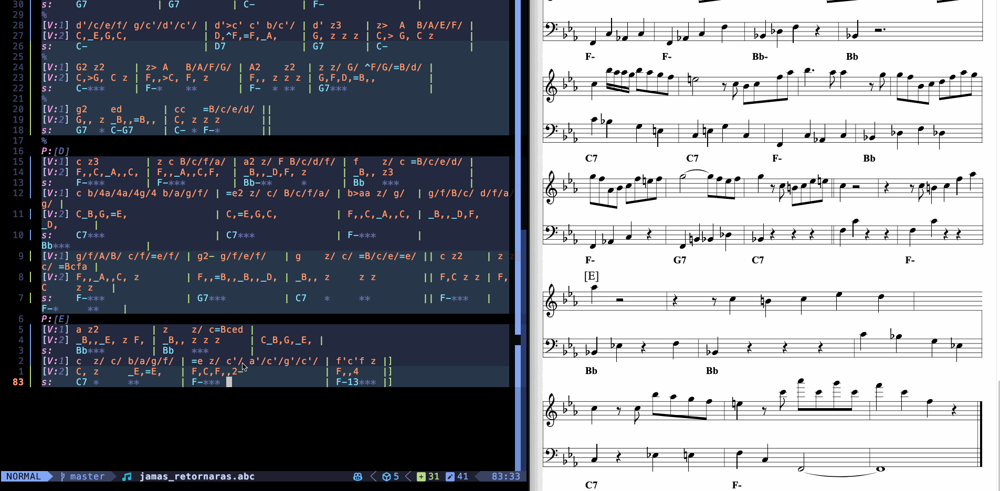
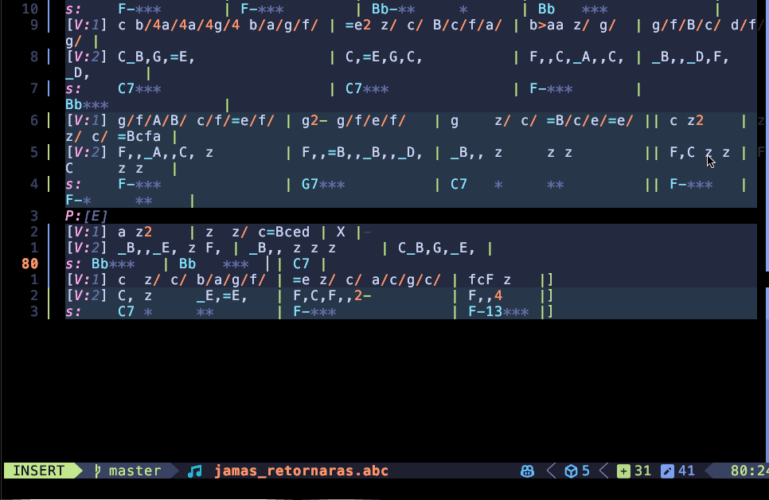

# abc-lsp.nvim

A Neovim plugin for ABC music notation that provides language server features.

## Live preview in browser



## Score formatting



## Features

- Syntax highlighting for ABC notation
- Diagnostics for syntax errors
- Code formatting
- Completions for ABC notation symbols
- Custom commands for rhythm transformation and transposition
- Live preview of ABC notation in a browser
- Interactive cursor-based note highlighting in preview
- Export to HTML and SVG formats

## Requirements

- Neovim >= 0.7.0 (for built-in LSP support)
- Node.js and npm (for language server and preview server)
- [abc-lsp-server](https://github.com/AntoineBalaine/abc-lsp-server) (installed separately)
- [abc-parser](https://github.com/AntoineBalaine/abc_parse) (installed as a dependency of the server)

## Installation

### Using [packer.nvim](https://github.com/wbthomason/packer.nvim)

```lua
use {
  'AntoineBalaine/abc-lsp.nvim',
  run = 'cd preview-server && npm install && npm run build',
  config = function()
    require('abc_lsp').setup({
      lsp_path = '/path/to/abc-lsp-server/out/server.js'
    })
  end
}
```

### Using [lazy.nvim](https://github.com/folke/lazy.nvim)

```lua
{
  'AntoineBalaine/abc-lsp.nvim',
  build = 'cd preview-server && npm install && npm run build',
  config = function()
    require('abc_lsp').setup({
      lsp_path = '/path/to/abc-lsp-server/out/server.js'
    })
  end
}
```

## Server Installation

### ABC LSP Server

The ABC LSP server needs to be installed separately. You can install it globally:

```bash
# Clone the repository
git clone https://github.com/AntoineBalaine/abc-lsp-server.git
cd abc-lsp-server

# Install dependencies
npm install

# Build the server
npm run compile

# Create a symlink to make it globally available
npm link
```

### Preview Server

The preview server is included with the plugin and builds automatically when you install or update the plugin (via the `run`/`build` hook shown in installation examples).

**Requirements:** Node.js and npm must be installed.

#### Manual Rebuild

If you need to rebuild the preview server:

- **lazy.nvim**: `:Lazy build abc-lsp.nvim`
- **packer**: Re-run `:PackerSync`
- **Or use**: `:AbcInstall` command

For manual build from command line:
```bash
cd ~/.local/share/nvim/site/pack/packer/start/abc-lsp.nvim/preview-server
npm install && npm run build
```

## Configuration

You can configure the plugin by passing options to the setup function:

```lua
require('abc_lsp').setup({
  -- Server configuration
  server = {
    -- Path to the ABC LSP server executable
    cmd = { 'node', vim.fn.expand('~/.local/share/nvim/abc-lsp-server/out/server.js') },
    -- Server settings
    settings = {},
    -- Additional server capabilities
    capabilities = {},
  },
  
  -- Auto-start the server when opening an ABC file
  auto_start = true,
  
  -- Highlighting configuration
  highlighting = {
    -- Enable semantic token highlighting
    enable = true,
  },
  
  -- Preview configuration
  preview = {
    -- Auto-open preview when opening an ABC file
    auto_open = false,
    -- Port for the preview server
    port = 8088,
    -- Rendering options passed to abcjs
    options = {
      responsive = true,
      selectionColor = "#ff6600", -- Color for cursor highlighting
    },
  },
  
  -- Keymaps for ABC-specific commands
  keymaps = {
    -- Enable keymaps
    enabled = true,
    -- Rhythm transformation
    divide_rhythm = '<Leader>ad',
    multiply_rhythm = '<Leader>am',
    -- Transposition
    transpose_up = '<Leader>au',
    transpose_down = '<Leader>ad',
  },
})
```

## Commands

All commands are accessed via the `:Abc` command with subcommands. Use `:Abc` with no arguments to see all available commands with descriptions.

Tab completion is available: type `:Abc <Tab>` to see all subcommands.

### Rhythm & Transposition

- `:Abc rhythm_divide` - Divide rhythm in selection
- `:Abc rhythm_multiply` - Multiply rhythm in selection
- `:Abc transpose_up` - Transpose selection up an octave
- `:Abc transpose_down` - Transpose selection down an octave

### Preview

- `:Abc preview_open` - Open ABC preview in browser
- `:Abc preview_url` - Show and copy preview URL to clipboard
- `:Abc preview_reopen` - Reopen preview in browser
- `:Abc preview_stop` - Stop preview server

### Export

- `:Abc export_html` - Export as HTML
- `:Abc export_svg` - Export as SVG
- `:Abc print_preview` - Open print preview

### Server

- `:Abc server_start` - Start ABC LSP server
- `:Abc server_stop` - Stop ABC LSP server
- `:Abc server_restart` - Restart ABC LSP server

### Maintenance

- `:Abc install` - Install/rebuild preview server

## Keymaps

If keymaps are enabled, the following default keymaps are available in normal and visual mode:

- `<Leader>ad` - Divide rhythm
- `<Leader>am` - Multiply rhythm
- `<Leader>au` - Transpose up an octave
- `<Leader>ad` - Transpose down an octave

## License

MIT
